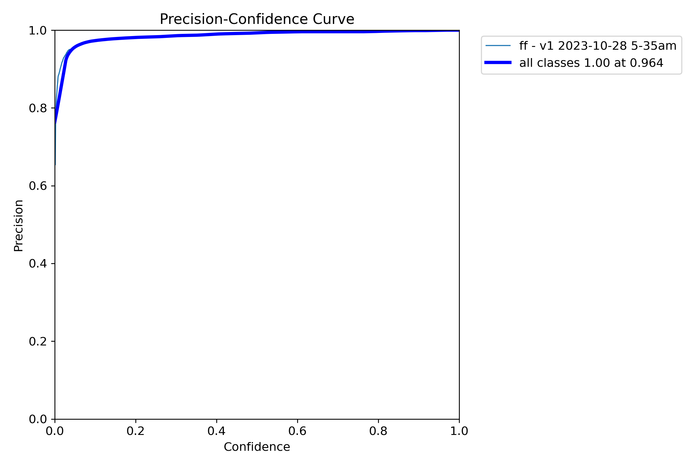
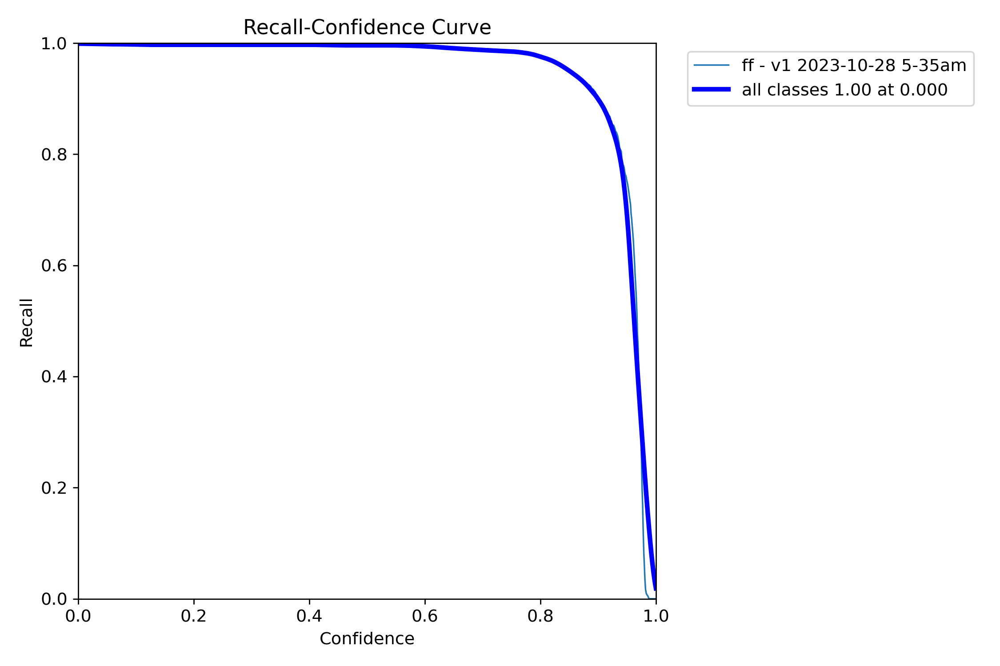
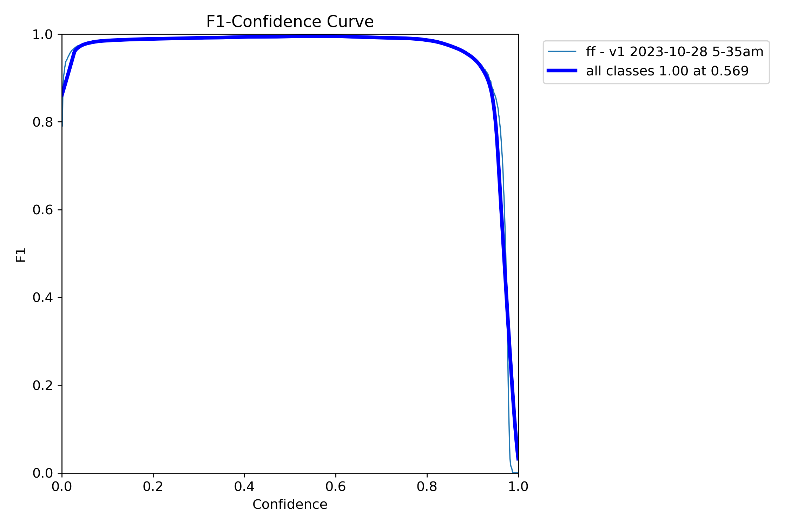
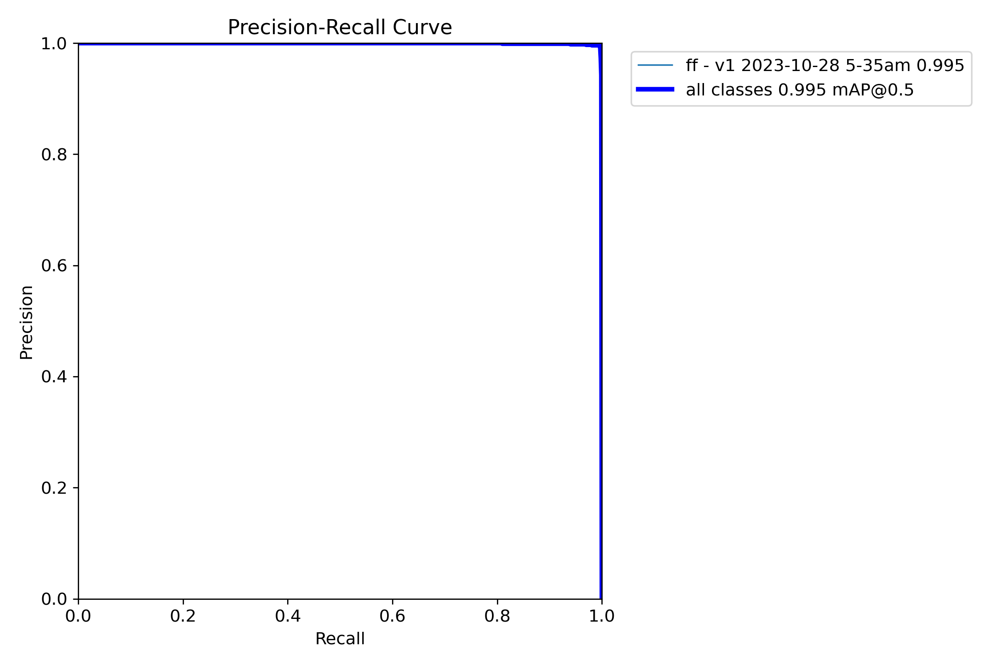
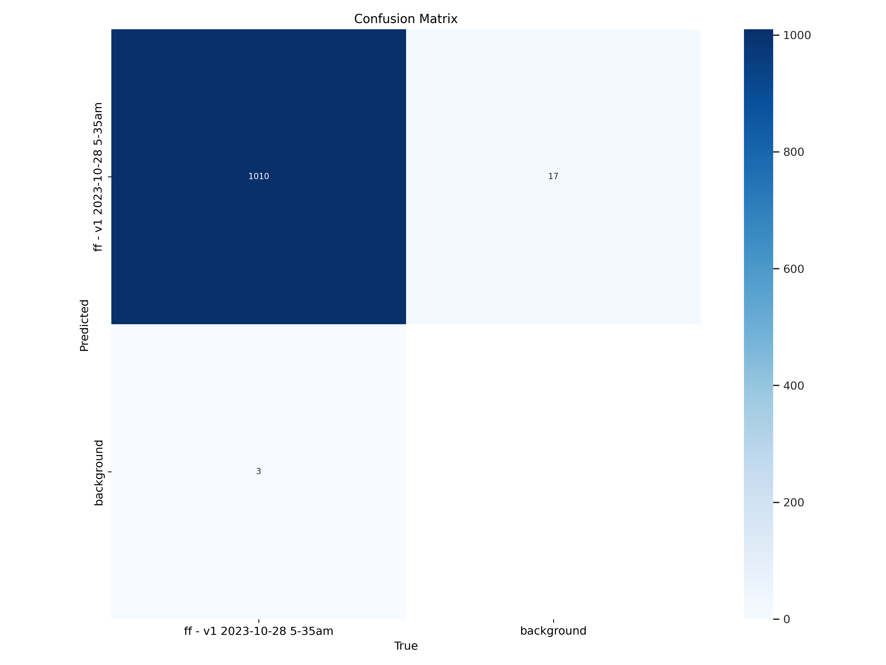
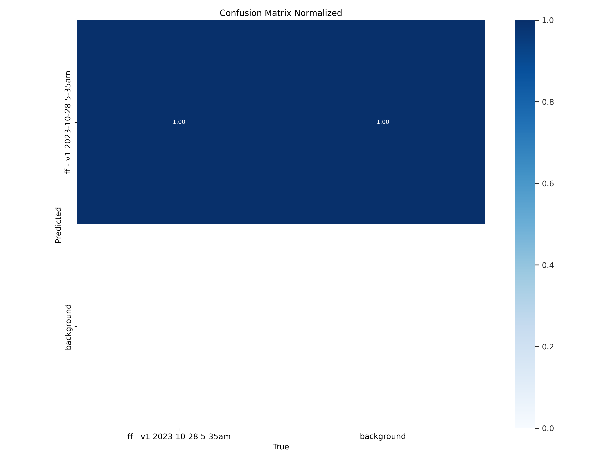
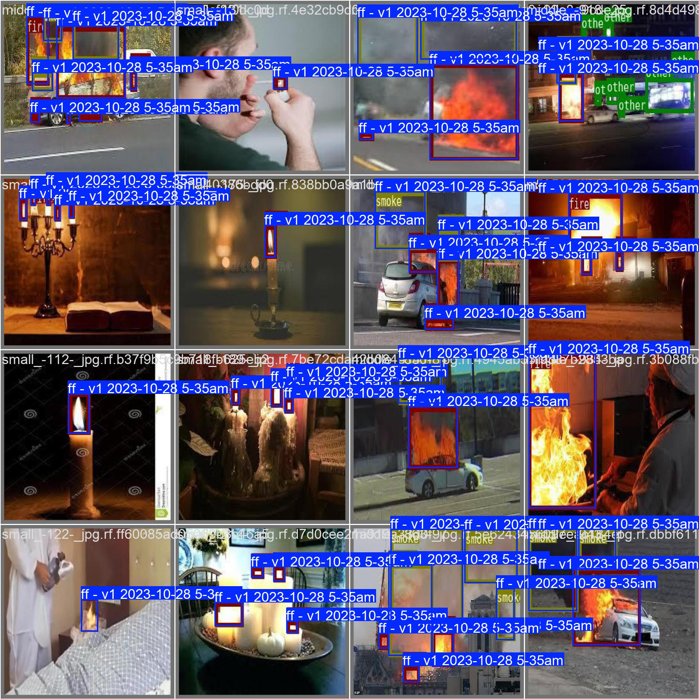
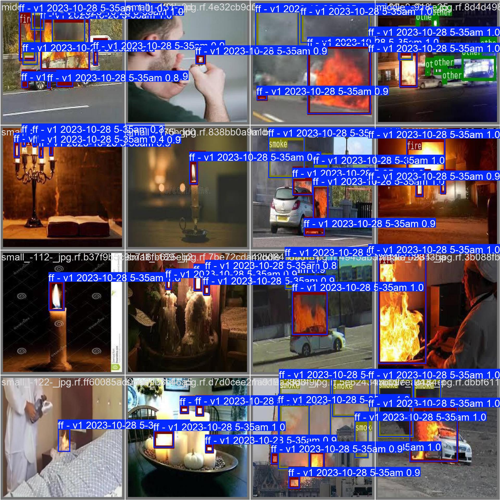
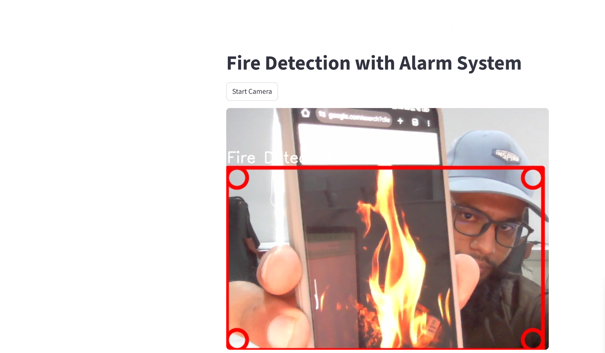

# 🔥 Fire Detection App (YOLOv8 + Streamlit)

A real-time fire detection application built using **YOLOv8** and **Streamlit**. This lightweight app analyzes live video input, detects fire with high accuracy, and sounds an alarm immediately upon detection. Ideal for safety and surveillance systems.

---

## 🚀 Features

- Real-time fire detection using YOLOv8  
- Streamlit-based interactive interface  
- Alarm system triggers when fire is detected  
- Lightweight and easy to deploy locally  

---

---

## 🧠 Model Training

The model was trained using YOLOv8 on a custom fire dataset.

### 📊 Training Metrics

<div align="center">
  <table>
    <tr>
      <td></td>
      <td></td>
    </tr>
    <tr>
      <td align="center">Precision Curve</td>
      <td align="center">Recall Curve</td>
    </tr>
    <tr>
      <td></td>
      <td></td>
    </tr>
    <tr>
      <td align="center">F1 Score Curve</td>
      <td align="center">Precision-Recall Curve</td>
    </tr>
  </table>
</div>

---

### 📉 Confusion Matrix

<div align="center">
  <table>
    <tr>
      <td></td>
      <td></td>
    </tr>
    <tr>
      <td align="center">Unnormalized</td>
      <td align="center">Normalized</td>
    </tr>
  </table>
</div>

---

### 🖼️ Validation Results

<div align="center">
  <table>
    <tr>
      <td></td>
      <td></td>
    </tr>
    <tr>
      <td align="center">Ground Truth Labels</td>
      <td align="center">Predicted Labels</td>
    </tr>
  </table>
</div>

---

## 🎬 Demo

<div align="center">
  
</div>

---

## 💡 How to Run

1. Clone the repository  
   ```bash
   git clone https://github.com/ali-haris/Fire-Detection-using-YOLOv8.git
   cd fire-detection-app


